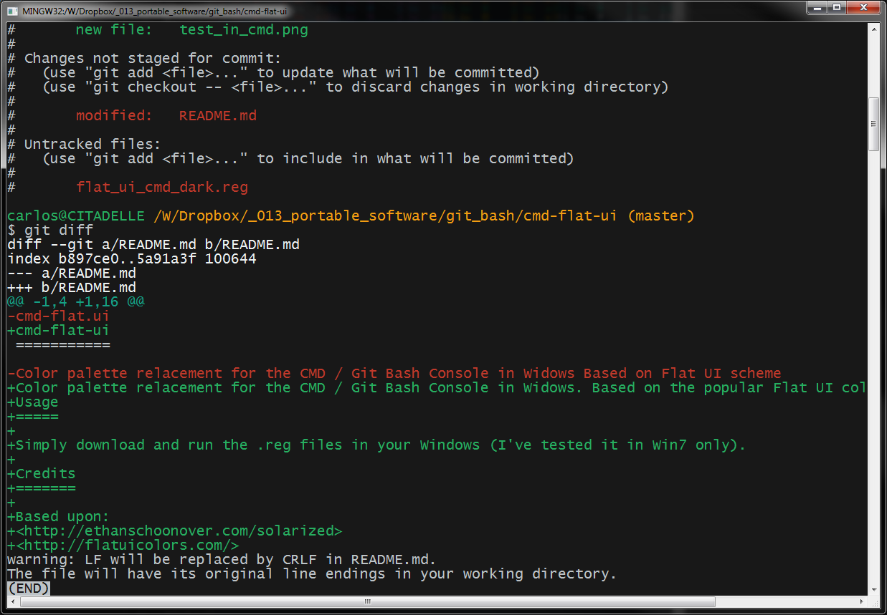
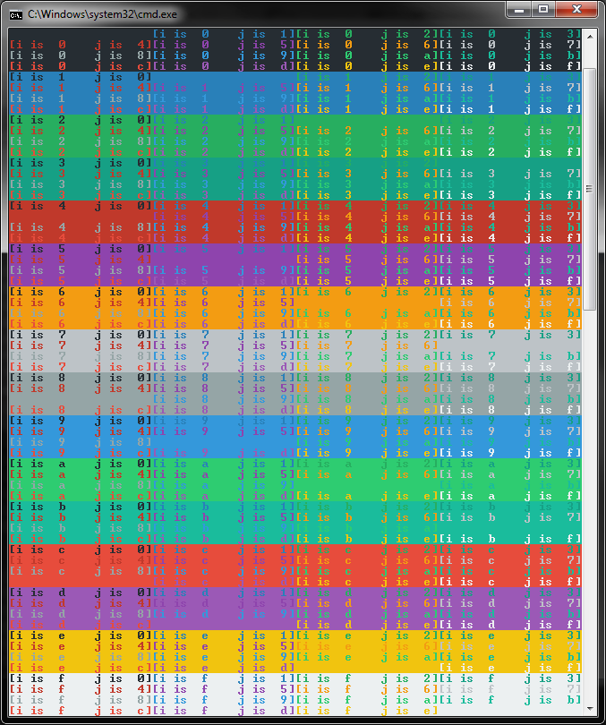

cmd-flat-ui
===========

Color palette relacement for the CMD / Git Bash Console in Widows. Based on the popular Flat UI color scheme. A much more armonius / relaxing / happy color scheme for your everyday work with the CMD / Git bash console.

Usage
=====

Simply download and run the .reg files in your Windows (I've tested it in Win7 only).

Screenshots
===========

Credits
=======

Based upon:
<http://ethanschoonover.com/solarized>
<http://flatuicolors.com/>
